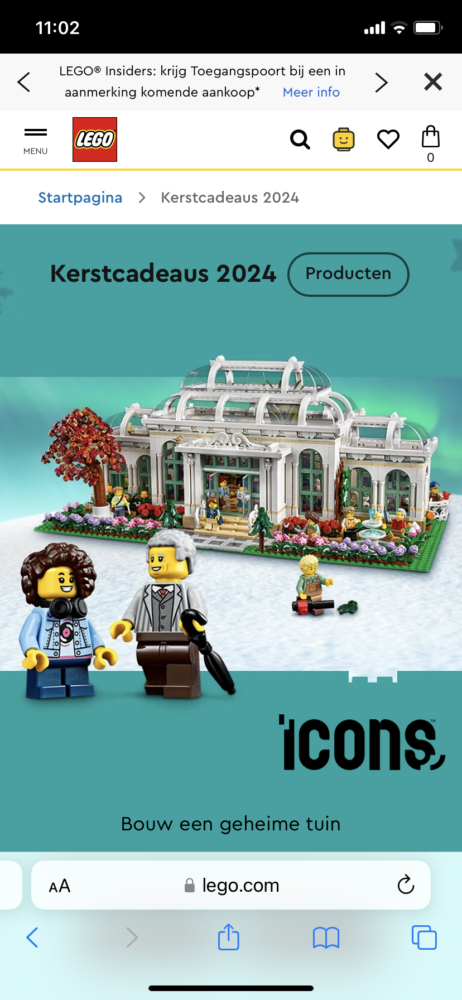
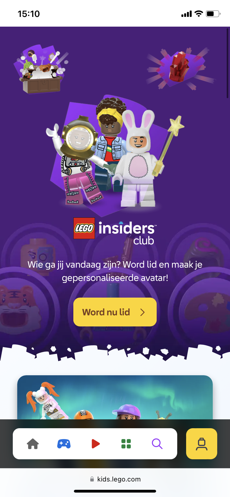
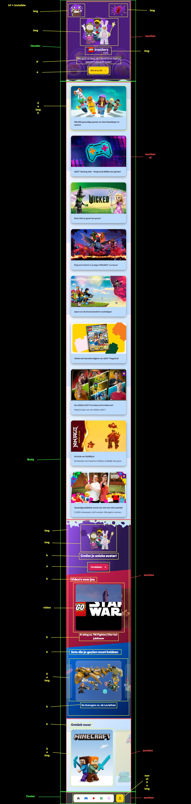

# Procesverslag
Markdown is een simpele manier om HTML te schrijven.  
Markdown cheat cheet: [Hulp bij het schrijven van Markdown](https://github.com/adam-p/markdown-here/wiki/Markdown-Cheatsheet).

Nb. De standaardstructuur en de spartaanse opmaak van de README.md zijn helemaal prima. Het gaat om de inhoud van je procesverslag. Besteedt de tijd voor pracht en praal aan je website.

Nb. Door *open* toe te voegen aan een *details* element kun je deze standaard open zetten. Fijn om dat steeds voor de relevante stuk(ken) te doen.

## Jij

  
uitwerken voor kick-off werkgroep

  ### Auteur:
  Tess Wieman

  #### Je startniveau:
  Blauw

  #### Je focus:
  Responsive
 

## Je website

  
uitwerken voor kick-off werkgroep

  ### Je opdracht:
  https://www.lego.com/nl-nl 

  #### Screenshot(s) van de eerste pagina (small screen):
  Kerstcadeau's   
  

  #### Screenshot(s) van de tweede pagina (small screen): 
  speelplek
  
 

## Toegankelijkheidstest 1/2 (week 1)

  
uitwerken na test in 2e werkgroep

  ### Bevindingen na de screenreader test
  - Lijst met je bevindingen die in de test naar voren kwamen:
  - De screenreader hapert heel snel als je naar een andere pagina toe gaat.
  - Engelse namen worden verkeert uitgesproken zoals: "idea". 
  - Het sprak heel snel, maar ik kwam erachter dat dit aangepast kan worden. 
  - De navigatie menu klapt niet open.
  - Sommige afbeeldingen of knoppen hebben onduidelijke namen.
  - Het toetsenbord geeft wel geluidjes als een opdracht daarmee is gedaan als feedback.

  ### Oplossingen
  - Kleurcontrast groot maken voor kleurenblinden.
  - Correcte namen aan tags geven, zodat deze goed voorgelezen worden en te snappen zijn.
  - Aria hidden = "true; gebruiken als onderdelen niet voorgezelen hoeven door de screenreader.
  - Zo veelmogelijk Nederlandse woorden gebruiken behalve bij namen (bijv: "Star Wars"). 
  - Ondertiteling bij video's plaatsen.

  ### Bevindingen WCAG checklist
  Content 
  - De website gebruikt duidelijke taal en vermijd stijlfiguren, idiomen en ingewikkelde metaforen. Maar Engelse woorden worden niet goed uitgesproken.
  - De inhoud van knoppen, links en fomrulieren, hebben een unieke en duidelijke beschrijvingen.

  Global code 
  - De HTML code is vrijwel gevalideert, echter zijn er wel een aantal errors. 
  - Gebruik een lang attribuut voor het html-element.
  - Elke pagina heeft zijn eigen unieke titel.
  - Zorg ervoor dat de viewport-zoom niet is uitgeschakeld.

  Keyboard
  - Er is een zichtbare focusstijl voor interactieve elementen waarnaar wordt genavigeerd (tab en shift + tab) via toetsenbord invoer. Maar soms loopt deze vast nadat er is genavigeerd vooral als er naar een volgende pagina wordt genavigeerd.
  - De focusvolgorde van het toetsenbord komt overeen met de visuele lay-out.
  
  Mobile and touch
  - De site kan in elke richting worden gedraaid.
  - Horizontaal scrollen verwijderen lukt.
  - Knoppen en linkpictogrammen kunnen gemakkelijk worden geactiveerd.
  - Er is voldoende ruitme tussen interactieve items om een scrolgebied te creëen.

  Headings
  - Er worden kopelementen gebruikt om inhoud te introduceren.
  - Er wordt één h1 tag gebruikt op een pagina.
  - Kopelementen worden in een logische volgorde geschreven.
  - Kopniveaus worden niet overgeslagen.

  Lists
  - Er worden listelementen gebruikt voor lijstinhoud.
  
  Images
  - Niet alle images hebben een alt atribute. 
  - Decoratieve plaatsen hebben geen alt atribute.
  - Er zijn geen moeilijke afbeeldingen die tekst-alternatieven nodig heeft.
  - Afbeeldingen die tekst bevatten, hebben een alt-beschrijving. Deze is soms niet heel concreet.

  Media
  - Video's worden wel automatisch afgespeeld.
  - Alle media kan in ieder geval met de muis worden gepauzeerd, maar met de toetsenbord is het mij nog niet gelukt (het kan kloppen dat ik niet de goede combinatie weet op mijn toetsenbord om dat met een screenreader te kunnen doen).
  - Er zijn geen ondertitels aanwezig bij video's.
  - Audio transcripties zijn niet aanwezig. 

  Controls
  - Er worden a elementen gebruikt voor links.
  - Links zijn herkenbaar als links.
  - Er worden button elementen gebruikt voor buttons.
  - Links die in een nieuwe tablad of venster worden geopend worden geïdentiviseerd.

  Appearance
  - De donkere modus wordt niet ondersteund.
  - Hoge-contrast modus wordt ondersteund.
  - De tekst wordt vergroot.
  - Kleur is niet de enige manier waarop informatie wordt overgebracht.
  
  Animation 
  - Animaties zijn subtiel op de website.
  - Er is geen mechanisme om achtergrond video te pauzeren.
  - Niet alle afbeeldingen hebben een media query. 
  
  Color contrast
  - Alle teksten hebben een normaal formaat.
  - Alle teksten hebben een contrast.
  - Alle icoons hebben een contrast.
  - De pagina heeft geen drak modus 

## Breakdownschets (week 1)

  
uitwerken na afloop 3e werkgroep

  ### Breakdown schets, kerstcadeaus: 
  

  ### Breakdown schets, speelplek: 
  

## Voortgang 1 (week 2)

  
uitwerken voor 1e voortgang

  ### Stand van zaken
  hier dit ging goed & dit was lastig (neem ook screenshots op van delen van je website en code)

  ### Agenda voor meeting
  samen met je groepje opstellen

  | student 1 Tess                                                           | student 2          | student 3    | student 4        |
  | ---                                                                      | ---                | ---          | ---              |
  | Moet ik onder plaatjes een p of een h gebruiken?                         | en dit             | en ik dit    | en dan ik dat    |
  | Als het scherm groter wordt verandere mijn plaatjes, hoe doe ik dit?     | dit als er tijd is | nog een punt | dit wil ik zeker |
  | Waarneer gebruik je een descendant in CSS?                               | ...                | ...          | ...              |

  ### Verslag van meeting
  hier na afloop snel de uitkomsten van de meeting vastleggen

  - Ik moet opnieuw mijn breakdown schets maken, want in Miro kan deze niet als image in hoge kwaliteit worden gemaakt. Ik kreeg als tip om het in Figma te doen. 
  - Voor icoontjes moet ik ::before gebruiken in plaats van een img tag, want zo wordt het toegankelijker. Maar later kreeg ik als opmerking van de docent Ivo dat ik ook een alt tag of een aria-label kan doen, want zo worden de icoontjes ook voorgelzen met de screenreader. 
  - De button die in een article stonden moesten veranderd worden naar een div. 
  - P in de section exclusieve veranderen naar een H tag.
  - Als ik een img wil veranderen van source omdat mijn pagina groter wordt moet ik in de html de media tag gebruiken.
  - MDN is een goede website!

## Voortgang 2 (week 3)

  
uitwerken voor 2e voortgang

  ### Stand van zaken
  hier dit ging goed & dit was lastig (neem ook screenshots op van delen van je website en code)

  ### Agenda voor meeting
  samen met je groepje opstellen

  | student 1 Tess                                                                   | student 2          | student 3    | student 4        |
  | ---                                                                              | ---                | ---          | ---              |
  | Wanneer gebruik je een div en wanneer een article?                               | en dit             | en ik dit    | en dan ik dat    |
  | Wat is er mis met mijn hambugermenu dat het niet werkt?                          | dit als er tijd is | nog een punt | dit wil ik zeker |
  | Hoe orden ik een lijstje van mijn hamburger menu in nog een aantal lijstjes?     | ...                | ...          | ...              |
  | Hoe maak in een carousel van de artikelen?                                       | ...                | ...          | ...              |
  | Hoe maak in de afstand in een grid-template kleiner?                             | ...                | ...          | ...              |
  | Waarom wordt de class "icons" in de image tag opgegeven moment niet pasbaar?     | ...                | ...          | ...              |
  | Bij mijn volgende pagina (speelplek) maak ik ook sections, hoe moet ik deze dan naar css linken nu op mijn eerste pagina (kerstcadeaus) noem ik de section met de :nth-of-type    | ...                | ...          | ...              |

  ### Verslag van meeting
  hier na afloop snel de uitkomsten van de meeting vastleggen

  - Input type is email gebruiken in plaats van text.
  - :user-invalid gebruiken om de email gevlideerd of niet gevalideert checken in CSS.
  - Kies of je een class of nth-of-type gebruikt voor CSS 
  - In een lijst een lijstje maken voor de menu. Je moet een paar maken 2-3, maar je hoeft niet alles te doen. 
  - Winkelwagen veranderen naar een a tag 
  - Artikelen ordening veranderen zodat het logisch is voor een screenreader
  - regel 120 article veranderen naar div
  - HREF naar # veranderen 
  - Plaatjes veranderen naar procenten 

## Toegankelijkheidstest 2/2 (week 4)

  
uitwerken na test in 9e werkgroep

  ### Bevindingen screenreader test
  - Alle linkjes doen het en hebben een goede naam.
  - Het is me momenteel nog niet gelukt om de alle tags te laten voorlezen. Ik denk dat het eerder aan mij ligt dat de screenreader best lastig vind.
  - Alle menu onderdelen worden nu nog steeds voorgelezen ook al zijn ze in de header te zien (op groot scherm).
  - De screenreader loopt niet vast nadat een toetsenbord functie wordt gebruikt. 

## Voortgang 3 (week 4)

  
uitwerken voor 3e voortgang

  ### Stand van zaken
  hier dit ging goed & dit was lastig (neem ook screenshots op van delen van je website en code)

  ### Agenda voor meeting
  samen met je groepje opstellen

  | student 1 Tess                                                             | student 2          | student 3    | student 4        |
  | ---                                                                        | ---                | ---          | ---              |
  | De artikelen section wil niet correct responsive hoe verbeter ik dit?      | en dit             | en ik dit    | en dan ik dat    |
  | Hoe maak je een pop-up?                                                    | dit als er tijd is | nog een punt | dit wil ik zeker |
  | Hoe kan ik de video van de Speelplek pagina in mijn document zetten?       | ...                | ...          | ...              |
  | De afbeelding banner met de kat is op mobiel ingezoomd en op laptop zijn normale grootte, hoe zoom ik een afbeelding in?                                                                          | ...                | ...          | ...              |
  | Tips voor de side-slider met positionering (vanaf Home Alone set)?         | ...                | ...          | ...              |
  | Hoe selecteer in mijn css media query de footer ul li?                     | ...                | ...          | ...              |
  | Moet ik plaatjes verander van kleur bij dark mode, zo ja hoe?              | ...                | ...          | ...              |  

  ### Verslag van meeting
  hier na afloop snel de uitkomsten van de meeting vastleggen

  - Pagina id geven (in de main of body), zodat de css makkelijk in één te doen.
  - Media screen and (minmax ..px) {} is in principe niet nodig maar maakt dat printen en kleuren mogelijk is. 
  - Video zit in de source van de website. Deze downloaden en in mapje zetten.
  - Img width 100% geven in CSS video ook
  - Bij video autpolay muted loop zetten.
  - Nog een aparte javascript en css maken voor de tweede pagina. 
  - Pop up op dezelfde manier als het het hamburger menu.
  - 10em zetten bij min-width of max-width geven. 
  - Picture gebruiken voor plaatje veranderen bij de katBanner.

## Eindgesprek (week 5)

  
uitwerken voor eindgesprek

  ### Je uitkomst - karakteristiek screenshots:
  
  

  ### Dit ging goed/Heb ik geleerd: 
  grid 
  

  ### Dit was lastig/Is niet gelukt:

  - Het is mij niet gelukt op pop-ups te maken voor buttons in de header.
  
  - Het is mij niet gelukt om een de kopjes van navLijst in de header te zetten als het scherm groter wordt. Maar de screenreader leest dit wel voor op elk beelscherm formaat.
  
  - De hele header is mij niet gelukt om na te maken bij de speelplek pagina. 
  
  
  
  
  - Het is mij niet gelukt om #legochristmas plaatjes een tekst te geven en deze te positioneren, Dit kwam omdat het niet responsive zou kunnen werken. Toen heb ik met figcaption gewerkt, maar dan werkt de carousel niet meer. Dus heb ik het oorspronkelijke probleem opgelost door een goede atl tag te geven dat zegt wat de teksten zouden zeggen.
    
  - Het is mij op de speelplek pagina niet gelukt om twee soorten carousels te combineren. Ik heb dit probleem opgelost door overflow-x: auto; te gebruiken. 
  
  
  - Het is mij niet gelukt om in de media query van de footer de ul goed te plaatsen. :nth-of-child, :nth-of-type en een class toevoegen werkte niet. 
  
  
  - De winkelwagen werkt niet als er op de "In tas" gelikt wordt. 
  
  
  - De font-family Cera Pro is nergens als code te downloaden, dus deze heb ik niet kunnen toevoegen. 

## Bronnenlijst

  
continu bijhouden terwijl je werkt

  Nb. Wees specifiek ('css-tricks' als bron is bijv. niet specifiek genoeg). 
  Nb. ChatGpT en andere AI horen er ook bij.
  Nb. Vermeld de bronnen ook in je code.

  1. [css grid generator](https://cssgrid-generator.netlify.app/)
  2. [css tricks flexbox](https://css-tricks.com/snippets/css/a-guide-to-flexbox/)
  3. [codepen carousel ](https://codepen.io/shooft/pen/ZEpXmrg)
  4. header, Thomas Norden & ChatGPT
  5. [css details en summary](https://www.sitepoint.com/style-html-details-element/)
  6. [picture tag](https://developer.mozilla.org/en-US/docs/Web/HTML/Element/picture)
  7. [tweede submenu openen](https://chatgpt.com/c/6752e90d-10b4-8004-872b-b24a43b9ee54)
  8. [white spce, overflow en text-overflow](https://chatgpt.com/c/6756ccab-38ec-8004-83e3-991aae302577)

